# Claude × GitHub Dashboard

A local-only dashboard that cross-references **Claude Code usage** (tokens, cost, sessions) with **GitHub output** (lines of code, pull requests, commits, languages) to measure **output per Claude dollar** — the productivity signal behind the raw volume of tokens consumed.

<p align="center">
  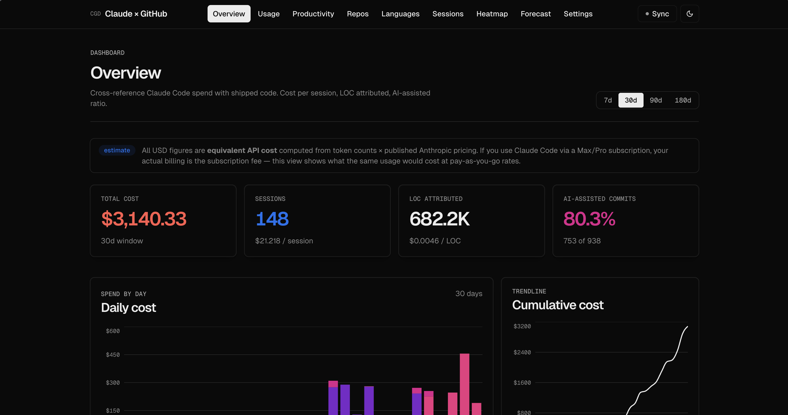
</p>

<p align="center">
  <sub>
    Vercel/Geist-inspired interface &nbsp;·&nbsp; Runs entirely on your machine &nbsp;·&nbsp; Single-user &nbsp;·&nbsp; No telemetry
  </sub>
</p>

---

## Table of contents

1. [Motivation](#motivation)
2. [Technology stack](#technology-stack)
3. [Quick start](#quick-start)
4. [Features](#features)
5. [Themes](#themes)
6. [Architecture](#architecture)
7. [Project structure](#project-structure)
8. [Scripts](#scripts)
9. [Privacy](#privacy)
10. [Correlation accuracy](#correlation-accuracy)
11. [Platform support](#platform-support)
12. [Known limits](#known-limits)
13. [Roadmap](#roadmap)
14. [Credits](#credits)

---

## Motivation

Standalone Claude Code usage trackers report spend. Git analytics report shipped code. Neither answers the operational question an AI-assisted engineer actually cares about:

> *Is Claude helping me ship faster — and at what unit economics?*

This dashboard joins the two signals and surfaces the numbers behind the intuition:

- **Cost breakdown by model** (Opus, Sonnet, Haiku) with cache tiers resolved correctly
- **Lines of code per dollar** — the true productivity ratio, trended daily
- **AI-assisted commit detection** via deterministic (`Co-Authored-By`) and heuristic (file overlap, time proximity, branch match) signals
- **Source code distribution** per repository, powered by GitHub Linguist
- **Burn-rate forecast** projected from the last seven days of spend

---

## Technology stack

| Layer | Choice |
|---|---|
| Bundler | [Vite 6](https://vitejs.dev) |
| UI | React 19, [Tailwind v4](https://tailwindcss.com), [Recharts](https://recharts.org) |
| Typography | Geist Sans / Geist Mono (served via Google Fonts) |
| Design system | [Vercel / Geist](DESIGN.md) — shadow-as-border, OpenType ligatures, three-weight scale |
| Language icons | [simple-icons](https://simpleicons.org) — 45+ languages mapped |
| Data fetching | [TanStack Query](https://tanstack.com/query) |
| Routing | [React Router v7](https://reactrouter.com) |
| Backend | [Hono](https://hono.dev) on Node |
| ORM / DB | [Drizzle](https://orm.drizzle.team) with [`better-sqlite3`](https://github.com/WiseLibs/better-sqlite3) |
| GitHub client | `@octokit/graphql`, `@octokit/rest` |
| Git client | [`simple-git`](https://github.com/steveukx/git-js) |
| Secret storage | macOS Keychain via [`keytar`](https://github.com/atom/node-keytar) |

---

## Quick start

Requires Node 20 or later, pnpm 10 or later. Primary target is macOS; Windows and Linux work with caveats — see [Platform support](#platform-support).

```bash
# Install dependencies across all workspaces
pnpm install

# Create the SQLite schema
pnpm db:migrate

# Start the backend (3001) and frontend (5173) concurrently
pnpm dev
```

Open [http://localhost:5173](http://localhost:5173). The dashboard synchronises on boot.

### Configuring a GitHub token

For authoritative commit history (the pushed state), pull request metadata, and language statistics:

1. Generate a personal access token at [github.com/settings/tokens](https://github.com/settings/tokens). A classic token with the `repo` scope is sufficient; a fine-grained token scoped to specific repositories is preferred.
2. Paste the token into **Settings → Personal access token** in the dashboard.
3. Click **Sync**.

The token is written to the macOS Keychain via `keytar`; it is never stored in `localStorage`, the SQLite database, or environment variables.

---

## Features

### Overview

A single-pane view of the core metrics. KPI cards summarise cost, session count, attributed lines of code, and AI-assisted commit ratio. Primary chart shows daily Claude spend stacked by model; secondary chart tracks cumulative cost.


### Usage

Daily token breakdown — input, output, cache read, and cache write — stacked per model. A scannable table complements the chart for tabular review or manual export.

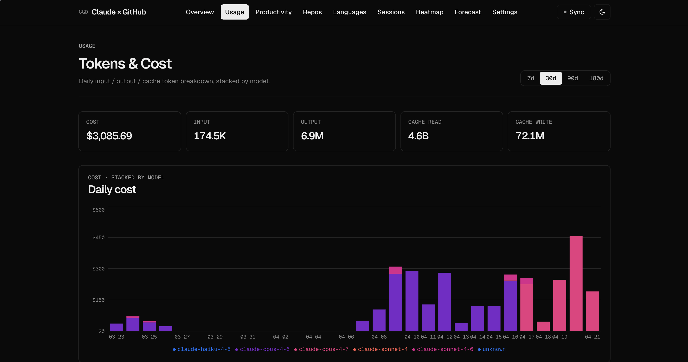

> All monetary figures are **equivalent API cost**, computed from token counts and published Anthropic pricing. For users on a Max or Pro subscription, actual billing is the flat subscription fee; this view shows the pay-as-you-go equivalent of the same workload.

### Productivity

Lines-of-code per dollar trendline plus a daily cost-versus-LOC scatter. The upper-left region of the scatter is the efficient frontier: cheap days with high output.

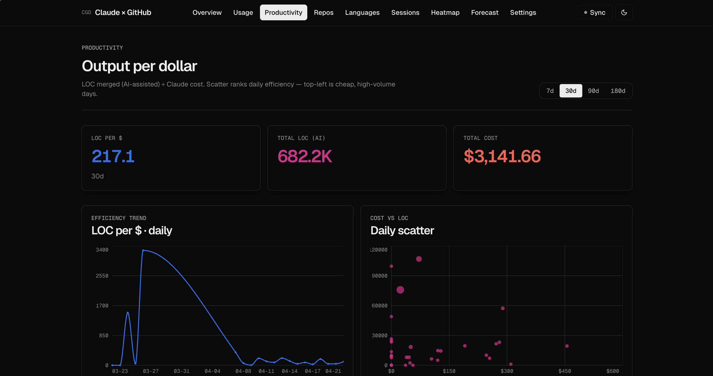

### Repositories

Every repository discovered through Claude Code session working directories. The table surfaces, per repository:

- Lines added and removed
- Net LOC
- AI-assisted commit ratio

A daily additions-and-deletions churn chart sits above the table with 30 / 90 / 180-day range filters.

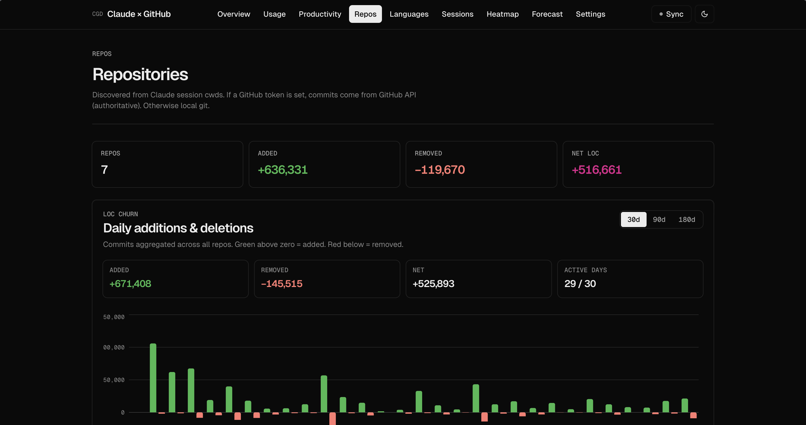

Selecting a row navigates to the [repository detail](#repository-detail) view.

### Repository detail

Per-repository deep dive. Four stat cards cover window and all-time totals. Below them, a commit timeline with per-commit AI-assist badges runs alongside a list of recent pull requests.

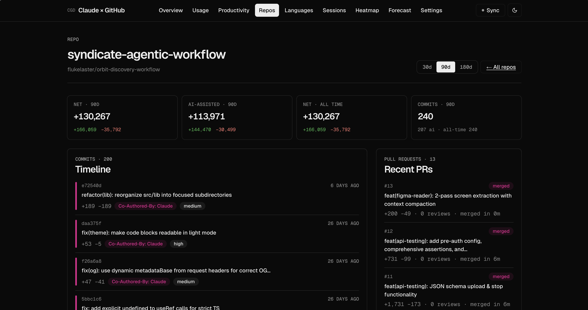

### Languages

Source code distribution across every indexed repository. Data is drawn from GitHub Linguist; icons and brand colours are resolved through `simple-icons`, with a coloured-dot fallback for languages not yet present in the icon set.

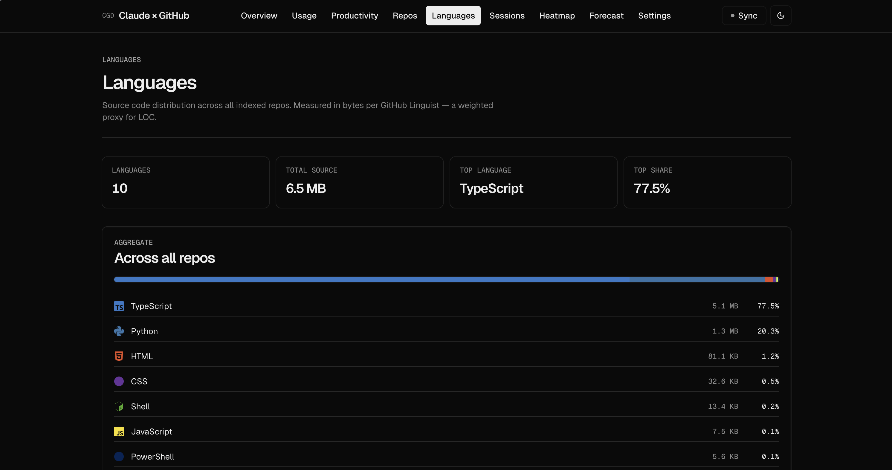

### Sessions

Every Claude Code session, listed by recency, with model, working branch, message count, token totals, and cost.

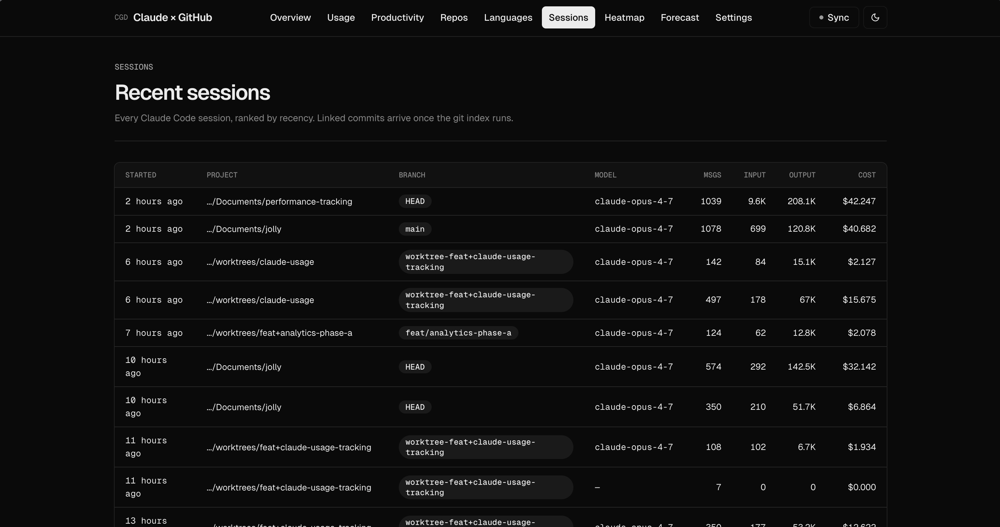

### Heatmap

Day-of-week against hour-of-day. Toggle the metric between **cost**, **sessions**, and **commits** to identify peak productivity windows.

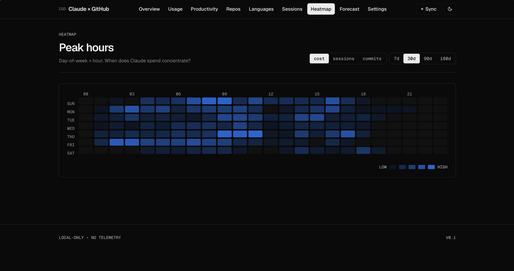

### Forecast

Burn-rate projection derived from the last seven days of spend. A cumulative area chart extrapolates 30 days forward from the most recent cadence.

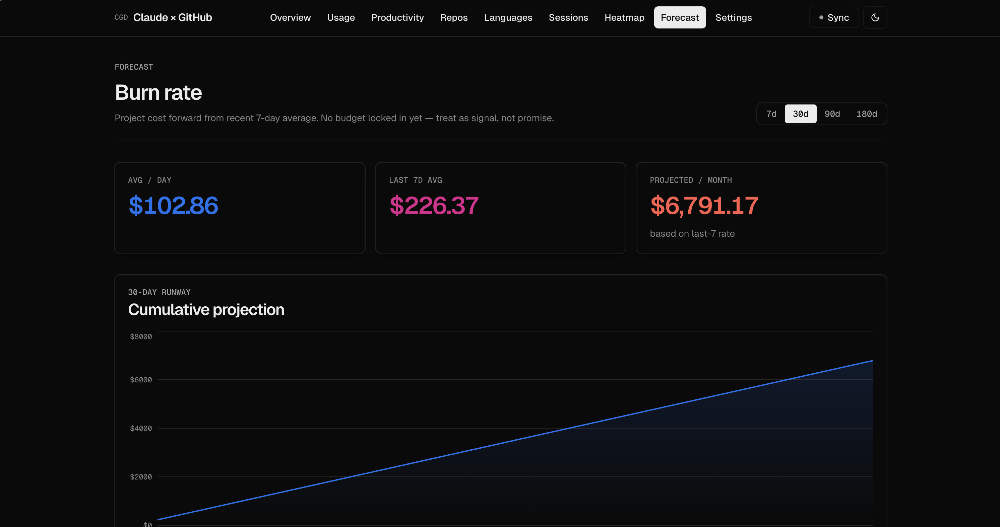

### Settings

Keychain-backed GitHub token management, sync state, last-run timestamp and errors, and the full privacy statement.

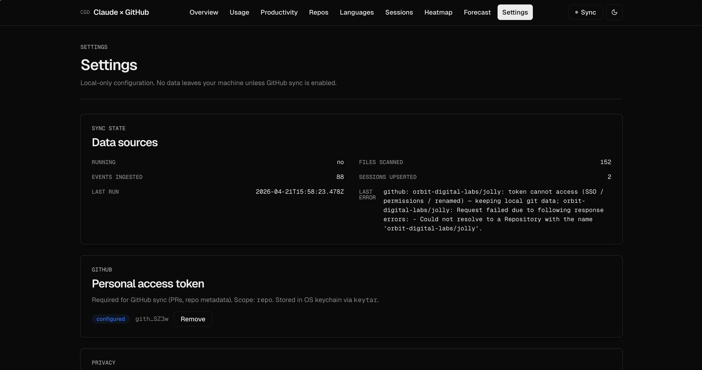

---

## Themes

The dashboard is designed dark-first. The Vercel shadow-as-border system ports cleanly back to light. The toggle sits in the header (sun/moon icon); the user's choice persists to `localStorage` and `prefers-color-scheme` is respected on first load.

| Dark | Light |
|:---:|:---:|
|  | 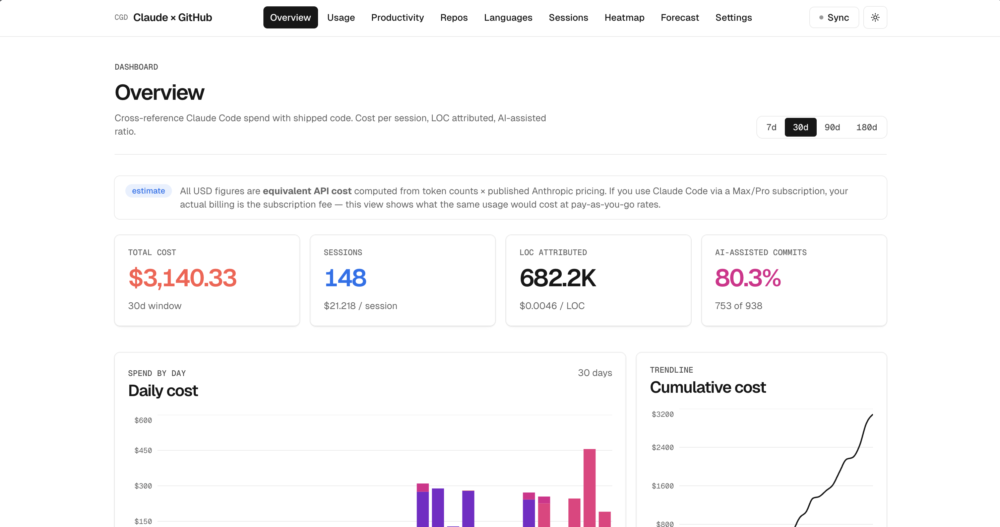 |

---

## Architecture

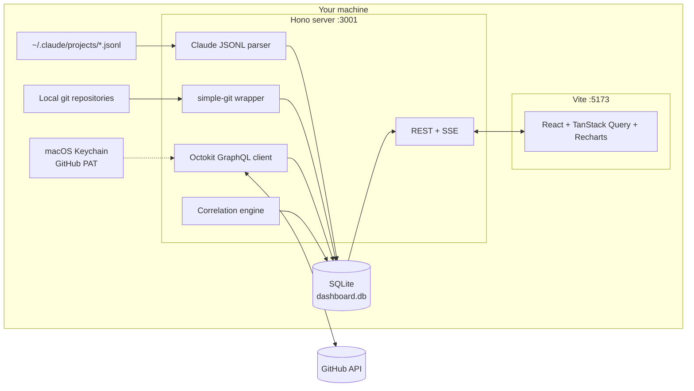

### Data flow

1. The **Claude parser** streams `~/.claude/projects/**/*.jsonl` with byte-offset incremental sync and deduplicates events by `message.id` to correctly handle session resume and replay. It writes per-message and per-session aggregates.
2. The **git indexer** discovers repositories from session working directories, resolves `.git` roots (including worktrees and submodules), and extracts commits with additions, deletions, file lists, and co-authors.
3. The **GitHub sync** step — active only when a token is configured — replaces local commit data with authoritative GraphQL results and fetches pull requests plus per-repository Linguist statistics. Per-repository fallback: repositories the token cannot resolve (e.g., private organisation repositories without SSO authorisation) retain their local git data.
4. The **correlation engine** scores every (session × commit) pair:
   - `Co-Authored-By: Claude` trailer: +50
   - File overlap ≥ 50%: +30; 20–50%: +15
   - Time proximity: 0–15 (inverse to minutes between session end and commit time)
   - Matching branch: +5
   - Threshold for a medium link is 40; high confidence is 70.
5. **Analytics** queries the SQLite tables via Drizzle and exposes typed REST endpoints.

See [implementation-plan.md](implementation-plan.md) for the complete specification.

---

## Project structure

```
performance-tracking/
├── apps/
│   ├── server/                    Hono backend
│   │   ├── src/
│   │   │   ├── db/
│   │   │   │   ├── schema.ts      Drizzle schema
│   │   │   │   ├── client.ts      better-sqlite3 instance
│   │   │   │   └── migrations/    Auto-generated by drizzle-kit
│   │   │   ├── services/
│   │   │   │   ├── claude-parser.ts    JSONL ingest, dedupe
│   │   │   │   ├── git-indexer.ts      simple-git + discovery
│   │   │   │   ├── github-client.ts    GraphQL commits, PRs, languages
│   │   │   │   ├── correlation.ts      Scoring, AI-assist detection
│   │   │   │   ├── analytics.ts        Query builders
│   │   │   │   ├── sync.ts             Orchestrator + SSE
│   │   │   │   └── keychain.ts         keytar wrapper
│   │   │   ├── routes/
│   │   │   │   ├── api.ts
│   │   │   │   └── settings.ts
│   │   │   └── index.ts
│   │   └── package.json
│   └── web/                       Vite + React frontend
│       ├── public/
│       │   ├── favicon.svg
│       │   └── apple-touch-icon.svg
│       ├── src/
│       │   ├── components/
│       │   │   ├── Shell.tsx
│       │   │   ├── Logos.tsx
│       │   │   ├── LangIcon.tsx
│       │   │   ├── LocDailyChart.tsx
│       │   │   ├── KpiCard.tsx
│       │   │   ├── ChartTooltip.tsx
│       │   │   ├── RangePicker.tsx
│       │   │   ├── PageHeader.tsx
│       │   │   ├── EmptyState.tsx
│       │   │   ├── ErrorBoundary.tsx
│       │   │   ├── SyncButton.tsx
│       │   │   └── ThemeToggle.tsx
│       │   ├── routes/
│       │   │   ├── Overview.tsx
│       │   │   ├── Usage.tsx
│       │   │   ├── Productivity.tsx
│       │   │   ├── Repos.tsx
│       │   │   ├── RepoDetail.tsx
│       │   │   ├── Languages.tsx
│       │   │   ├── Sessions.tsx
│       │   │   ├── Heatmap.tsx
│       │   │   ├── Forecast.tsx
│       │   │   └── Settings.tsx
│       │   ├── lib/
│       │   │   ├── api.ts
│       │   │   └── theme.ts
│       │   ├── index.css
│       │   ├── App.tsx
│       │   └── main.tsx
│       └── package.json
├── packages/
│   └── shared/                    Shared types, Zod schemas, pricing
│       └── src/
│           ├── pricing.ts         Per-model price table, cost calculator
│           ├── schemas.ts         Zod validators
│           ├── types.ts
│           └── index.ts
├── docs/screenshots/              Image assets referenced above
├── DESIGN.md                      Vercel / Geist design specification
├── implementation-plan.md         Original product specification
├── pnpm-workspace.yaml
├── tsconfig.base.json
└── README.md
```

---

## Scripts

| Command | Description |
|---|---|
| `pnpm dev` | Start server (port 3001) and frontend (port 5173) with hot reload |
| `pnpm build` | Type-check and build both applications |
| `pnpm start` | Run the production server |
| `pnpm db:generate` | Regenerate Drizzle migrations from `schema.ts` |
| `pnpm db:migrate` | Apply pending migrations to `data/dashboard.db` |
| `pnpm typecheck` | Type-check every workspace |

---

## Privacy

All processing is local. The only outbound traffic is to the GitHub API, and only when a token has been configured. There is no analytics, telemetry, or crash reporting.

- **Message content is never persisted.** The parser retains only token counts, model identifiers, timestamps, and — when available — the file paths touched by `Edit` and `Write` tool invocations.
- **The GitHub token is stored in the macOS Keychain** via `keytar`. It is not written to `localStorage`, the SQLite database, or environment variables.
- **Export is strictly local**: JSON via the REST API, or copy from tables. Nothing is transmitted to third parties.
- **Sub-agent transcripts** marked `sidechain: true` are excluded automatically to prevent double-counting.

---

## Correlation accuracy

AI-assist detection combines a deterministic signal (the `Co-Authored-By: Claude` commit trailer) with heuristics (file overlap, time window, branch match). The default threshold (score ≥ 40) favours precision over recall.

For repositories pulled via the GitHub API, per-commit file lists are not currently fetched — an optimisation that avoids one rate-limit point per commit. Correlation for those repositories therefore falls back to trailer, time, and branch signals. Repositories served from local git retain the full signal set.

Confidence tiers are exposed in the UI:

- **High** (≥ 70): near-certain linkage, typically a trailer plus strong time match.
- **Medium** (40–69): probable linkage, surfaced with a dimmed `medium` badge.
- **Low** (below threshold): not linked; omitted from aggregates.

---

## Platform support

| Platform | Status | Notes |
|---|---|---|
| **macOS** (x64, arm64) | Primary target | Fully tested. Keychain backed by macOS Keychain via `keytar`. |
| **Windows 10/11** | Supported, not end-to-end tested | Git for Windows must be on `PATH`. `keytar` uses Windows Credential Manager. If `better-sqlite3` or `keytar` lack a prebuilt binary for your Node minor version, Visual Studio Build Tools + Python are required for compilation. |
| **Linux** (x64, arm64) | Supported, not end-to-end tested | `keytar` requires `libsecret-1-dev` (Debian/Ubuntu: `apt install libsecret-1-dev`). Otherwise equivalent to macOS. |

Path handling is cross-platform: both Unix `/` and Windows `\` separators are accepted when parsing Claude session `cwd`, resolving git roots, matching session–commit links, and rendering repository paths in the UI.

## Known limits

- `keytar` relies on OS-native secret stores; headless Linux environments without `libsecret` will fall back to in-memory storage (secrets lost on restart).
- **Single-user by design.** One SQLite file, no authentication layer.
- **Equivalent cost, not actual spend.** Max and Pro subscribers pay a flat fee; the dashboard reports pay-as-you-go equivalent.
- **GitHub rate limits.** GraphQL is capped at 5,000 points per hour. Sync pauses cleanly with a surfaced error when the budget is depleted.
- **Unpushed commits** are visible only when no GitHub token is configured and the local git fallback is active.

---

## Roadmap

- [ ] Surface SSE sync progress in the UI (endpoint present, consumer pending)
- [ ] PDF export
- [ ] Per-commit file-list fetch for GitHub repositories (opt-in, higher correlation accuracy)
- [ ] Multi-account GitHub support
- [ ] Per-page chart palette adaptation to system-level colour scheme changes
- [ ] Tauri packaging (single binary, no terminal invocation)

---

## Credits

- Design language — [Vercel Geist](https://vercel.com/font); see [DESIGN.md](DESIGN.md).
- Language icons — [simple-icons](https://simpleicons.org) (CC0).
- Language colours — [GitHub Linguist](https://github.com/github-linguist/linguist).
- Pricing reference — [Anthropic pricing documentation](https://platform.claude.com/docs/en/docs/about-claude/pricing).
- Architectural inspiration — [`flukelaster/claude-usage`](https://github.com/flukelaster/claude-usage), [`ryoppippi/ccusage`](https://github.com/ryoppippi/ccusage).

---

<p align="center">
  <sub>Built with Claude Code.</sub>
</p>
