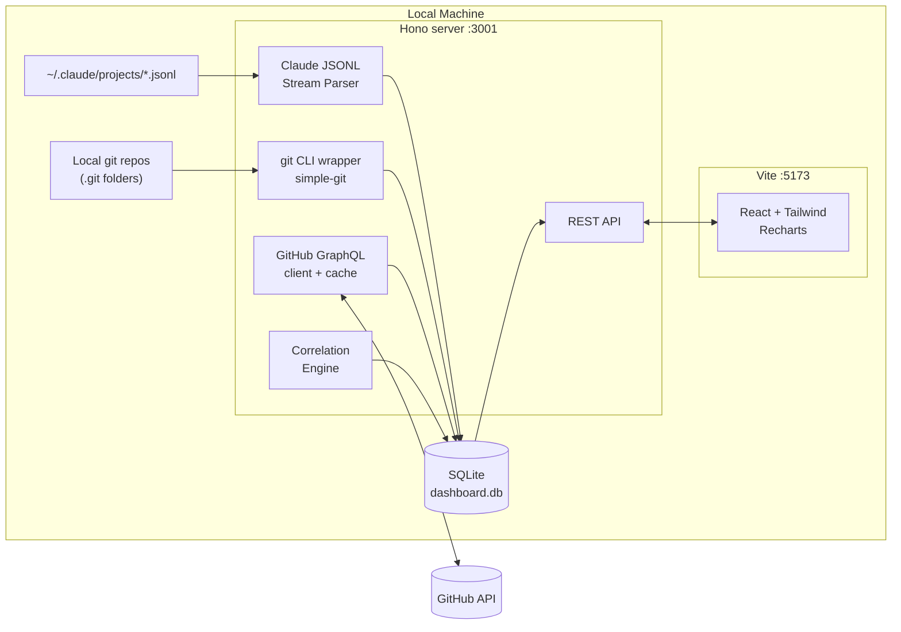

# Claude Usage × GitHub Dashboard — Implementation Plan

**Stack:** Vite + React + Tailwind (frontend) + local Node/Hono backend
**Deployment:** Local-only
**Reference concept:** [`flukelaster/claude-usage`](https://github.com/flukelaster/claude-usage)
**Goal:** Cross-reference Claude Code usage (tokens, cost, sessions) กับ GitHub output (LOC, PRs, commits) เพื่อวัด *output per Claude dollar* และ productivity signal จริง ไม่ใช่แค่ volume ของ token

---

## 1. Product Hypothesis

| Question ที่ Dashboard ต้องตอบ | Metric ที่ใช้ |
|---|---|
| Claude ช่วยให้ ship code เร็วขึ้นจริงไหม? | LOC merged / Claude cost ต่อวัน |
| Session ไหน "มีค่า" vs. "เผา token"? | Session cost ↔ commits ที่ออกมาในหน้าต่างเวลาเดียวกัน |
| Model ไหนคุ้มสุดสำหรับงานแต่ละประเภท? | Model × repo × avg LOC per session |
| AI-assisted commits แตกต่างจาก manual commits ยังไง? | Commit size distribution, revert rate, PR review time |
| กำลังจะเกิน budget เมื่อไหร่? | Burn rate projection (inherit จาก `claude-usage`) |

**Non-goals (phase 1):** multi-user, team leaderboard, code quality scoring, LLM-judge evaluation

---

## 2. System Architecture



**Design choice:** แยก backend ออกจาก Vite (ไม่ใช้ Vite plugin/middleware) เพราะ:

- filesystem scan + SQLite writes เป็น long-running — ไม่ควร block dev server
- อนาคตถ้าจะย้ายเป็น Tauri/Electron ก็ detach ได้ง่าย
- Vite dev proxy → `http://localhost:3001` ตอน dev, static build + start script ตอน production

---

## 3. Data Sources

### 3.1 Claude Code (local JSONL)

Path: `~/.claude/projects/<slugified-cwd>/<session-uuid>.jsonl`

Relevant fields ต่อ line (1 line = 1 message event):

| Field | Note |
|---|---|
| `sessionId` | UUID ของ session |
| `cwd` | absolute path → map ไป local git repo |
| `timestamp` | ISO 8601, UTC |
| `type` | `user` \| `assistant` \| `tool_use` \| `tool_result` |
| `message.model` | `claude-sonnet-4-6`, `claude-opus-4-6`, etc. |
| `message.usage` | `input_tokens`, `output_tokens`, `cache_creation_input_tokens`, `cache_read_input_tokens` |
| `toolUseResult.filePath` | ไฟล์ที่ Edit/Write touch |
| `gitBranch` | branch ตอนที่ message เกิด (มีใน entries ใหม่ๆ) |

**Incremental sync:** track byte offset ต่อไฟล์ใน `sync_state` table — สำคัญมากเพราะ JSONL โตเรื่อยๆ และการ re-parse ทั้ง dir ใช้เวลาหลายวินาที

### 3.2 Git (local)

ผ่าน `simple-git` หรือ `execa('git', …)`. ต้อง index แค่ repo ที่เจอใน `cwd` ของ Claude sessions (ไม่ต้อง scan ทั้งเครื่อง)

เก็บต่อ commit:

| Field | จาก |
|---|---|
| `sha`, `parentSha` | `git log` |
| `authorName`, `authorEmail`, `authoredAt` | `git log` |
| `committerName`, `committerEmail`, `committedAt` | `git log` |
| `message` | `git log` (full body) |
| `coAuthoredBy[]` | parse จาก trailer `Co-Authored-By:` |
| `additions`, `deletions`, `filesChanged[]` | `git show --numstat` |
| `isAIAssisted` | heuristic — เห็นใน §4 |

### 3.3 GitHub API (remote)

ใช้ GraphQL v4 เป็นหลัก (น้อย request กว่า REST มาก) + REST สำหรับ endpoint ที่ GraphQL ไม่ cover เช่น PR review time detail

| Data | Endpoint | หมายเหตุ |
|---|---|---|
| Repo aggregates (LOC by language, contributors) | REST `/repos/{o}/{r}/languages` + GraphQL `repository.languages` | cache 24h |
| Commit detail (additions/deletions) | GraphQL `repository.object(expression).history(first:100)` | 100 commits / query |
| PR metadata | GraphQL `repository.pullRequests(first:50, orderBy:UPDATED_AT)` | includes reviews, mergedAt |
| PR review timeline | REST `/repos/{o}/{r}/pulls/{n}/reviews` | fallback |
| Rate limit status | GraphQL `rateLimit` | query ทุก request |

**Rate limit reality:** 5000 points/hr authenticated. GraphQL query ที่ดึง 100 commits + 50 PRs พร้อม reviews ≈ 2–5 points. เพียงพอสำหรับ dashboard ส่วนตัว ถ้า cache ถูกต้อง

---

## 4. Correlation Engine (หัวใจของ product)

นี่คือส่วนที่ยากที่สุดและเป็นตัวแยก dashboard นี้จาก usage tracker ทั่วไป

### 4.1 Matching signals

| Signal | Strength | Caveat |
|---|---|---|
| **`Co-Authored-By: Claude`** ใน commit trailer | ★★★ (deterministic) | ต้องเปิดไว้ใน Claude Code config / ต้อง commit ผ่าน Claude |
| **cwd ↔ repo path** | ★★★ | straightforward |
| **Time window** (session end → commit ภายใน N นาที) | ★★ | noisy ถ้าใช้ Claude หลาย session พร้อมกัน |
| **File overlap** (files ที่ Claude edit ↔ files ใน commit diff) | ★★★ | ถูกต้องที่สุดแต่ต้อง parse tool_use ครบ |
| **Author email == git config user.email** | ★ | กรอง noise เฉยๆ ไม่ได้บอกว่า AI |

### 4.2 Linking algorithm

```
for each commit C in indexed repos:
    candidates = sessions where
        session.cwd == C.repo.path
        AND session.startedAt <= C.committedAt
        AND session.endedAt   >= C.committedAt - 2h   # commit อาจ lag หลัง session

    for each session S in candidates:
        score = 0
        if "Co-Authored-By: Claude" in C.message:     score += 50
        if file_overlap_ratio(S.editedFiles, C.filesChanged) >= 0.5: score += 30
        score += time_proximity_score(S.lastMessageAt, C.committedAt)  # 0–15
        if S.gitBranch == C.branch:                    score += 5

    link S→C where score >= threshold (default 40)
```

**Confidence tiers:** `high` (≥70), `medium` (40–69), `low` (shown dimmed หรือ toggle off)

### 4.3 Attribution rules (ป้องกัน double-count)

- 1 commit → link ได้หลาย sessions (session ยาว + commit เล็ก)
- 1 session → link ได้หลาย commits (session ใหญ่ + หลาย commits)
- LOC attribution = proportional ต่อ file overlap, ไม่ใช่ 100% ต่อ session

### 4.4 "AI-assisted commit" definition

Commit ถือว่า AI-assisted ถ้า (config ปรับได้):

1. มี `Co-Authored-By: Claude` trailer, **หรือ**
2. linked session อย่างน้อย 1 session ด้วย confidence ≥ `medium`, **และ**
3. file overlap ≥ 50%

---

## 5. Database Schema (SQLite + Drizzle)

```
sessions         (id, project_path, started_at, ended_at, message_count,
                  input_tokens, output_tokens, cache_read, cache_write,
                  cost_usd, primary_model, git_branch)

messages         (id, session_id, ts, type, model, tokens_json, files_touched_json)

repos            (id, local_path, github_owner, github_name, default_branch, last_synced_at)

commits          (sha, repo_id, author_email, authored_at, message,
                  additions, deletions, files_changed_json, is_ai_assisted,
                  co_authored_claude BOOLEAN, pr_number)

pull_requests    (number, repo_id, title, state, created_at, merged_at,
                  additions, deletions, review_count, time_to_merge_minutes,
                  ai_assisted_commit_count)

session_commit_links (session_id, commit_sha, score, confidence, attribution_ratio)

sync_state       (source, key, byte_offset, etag, last_synced_at)
```

Indexes ที่จำเป็น: `sessions(started_at)`, `commits(authored_at)`, `commits(repo_id, authored_at)`, composite ใน `session_commit_links`

---

## 6. API Surface

Backend expose REST (Hono) — เรียบง่าย พอสำหรับ local:

| Endpoint | Returns |
|---|---|
| `GET /api/overview?range=30d` | KPI cards: total cost, total LOC attributed, sessions, AI-assisted commit % |
| `GET /api/usage/daily?range=90d` | daily token + cost breakdown by model |
| `GET /api/productivity?range=30d` | LOC per $, LOC per session, trendline |
| `GET /api/repos` | list repos with aggregates |
| `GET /api/repos/:id/commits?range=30d&aiOnly=true` | commit list + linked sessions |
| `GET /api/repos/:id/prs` | PR metadata + AI-assisted ratio |
| `GET /api/sessions/:id` | session detail + linked commits |
| `GET /api/heatmap?metric=cost\|commits` | peak hours (day × hour) |
| `GET /api/forecast` | cost burn-rate projection |
| `POST /api/sync` | trigger manual sync |
| `GET /api/sync/status` | SSE stream ของ sync progress |

ทุก response เป็น JSON, cache-headers `no-store` (local only, data เปลี่ยนบ่อย)

---

## 7. UI / Views

### 7.1 Navigation

```
Overview  •  Usage  •  Productivity  •  Repos  •  Sessions  •  Forecast  •  Settings
```

### 7.2 Key views

| View | Primary chart | Secondary |
|---|---|---|
| **Overview** | 4 KPI cards (Cost, LOC, Sessions, AI-commit %) | 30-day dual-axis line: cost vs LOC |
| **Usage** | inherit จาก `claude-usage` (stacked bar per model) | daily table |
| **Productivity** (new) | LOC-per-dollar trendline | cost vs LOC scatter ต่อ session |
| **Repos** | table: repo, commits, LOC, AI-assist %, avg cost/commit | language breakdown donut |
| **Repo detail** | commit timeline (size bar + AI tag) | PR list + review time dist |
| **Session detail** | message timeline + cost stacked area | linked commits list + diff preview |
| **Heatmap** | day × hour (toggle: cost / commits / sessions) | — |
| **Forecast** | burn-rate line + budget threshold | what-if model switch simulator |

### 7.3 Critical UX considerations

- **Confidence transparency:** ทุก linked-commit ต้องโชว์ confidence badge (`high`/`med`/`low`) + hover tooltip อธิบายเหตุผลที่ match — ห้ามซ่อนว่า correlation เป็น heuristic
- **Empty states:** ถ้ายังไม่ sync GitHub → โชว์เฉพาะ Usage views + prompt ให้ใส่ token
- **Offline mode:** ไม่มี internet → block GitHub sync แต่ Usage + local git ต้องยังทำงานได้
- **No Claude data detected:** dashboard ต้องไม่ crash ถ้า `~/.claude/projects/` ว่าง — โชว์ onboarding

---

## 8. Implementation Phases

| Phase | Scope | Estimate |
|---|---|---|
| **0. Scaffolding** | Vite + React + Tailwind + Hono backend, SQLite + Drizzle, dev proxy | 1 day |
| **1. Claude data layer** | JSONL parser + incremental sync + cost calculator (port concept จาก `claude-usage`) | 2–3 days |
| **2. Usage views** | Overview, Usage, Heatmap, Forecast — standalone dashboard พร้อม ship | 2 days |
| **3. Git indexer** | scan repos ที่พบใน cwd, `simple-git` log extraction, commit table | 1–2 days |
| **4. GitHub sync** | GraphQL client, token setup UI, PR + LOC fetch + cache | 2 days |
| **5. Correlation engine** | matching algorithm, score, attribution, backfill job | 3 days |
| **6. Productivity + Repo views** | LOC per $, repo detail, session↔commit drilldown | 2 days |
| **7. Polish** | dark mode, export PDF, empty states, settings, error boundaries | 2 days |
| **Total** | | **~15–17 working days** |

**Ship strategy:** Phase 0–2 เป็น usable product เดี่ยวๆ (Claude usage dashboard) — ใช้งานได้ก่อน integration GitHub เสร็จ

---

## 9. Tech Choices (detail)

| Layer | Choice | เหตุผล |
|---|---|---|
| Bundler | Vite | ตาม requirement |
| UI | React 19 + Tailwind v4 | ตาม requirement |
| Routing | React Router v7 (data mode) | lightweight, data loaders |
| Data fetching | TanStack Query | cache + refetch + stale-while-revalidate |
| Charts | Recharts | เพียงพอ + simple DX |
| Backend | Hono on Node (หรือ Bun) | minimal, fast, good TS support |
| ORM | Drizzle | type-safe, SQLite native |
| DB | `better-sqlite3` | synchronous API, fastest for single-user |
| GitHub client | `@octokit/graphql` + `@octokit/rest` | official, retry built-in |
| Git | `simple-git` + spawn fallback | handles edge cases |
| Dates | `date-fns` | tree-shakable |
| Process manager | `concurrently` dev, single `node server.js` prod | |

**ไม่เลือก:**

- Next.js — overkill สำหรับ local-only, App Router ทำให้ split frontend/backend ยุ่ง
- Prisma — heavyweight, schema migrate กินเวลา
- tRPC — ไม่ต้องการ type-sharing ขนาดนั้น ใช้ Zod + manual types พอ

---

## 10. Edge Cases & Failure Modes

| Risk | Impact | Mitigation |
|---|---|---|
| JSONL schema change จาก Claude Code version ใหม่ | Parser break silent | Zod schema validation + fail-open (log warning, skip line) + schema version stamp |
| Repo path in `cwd` ไม่มี `.git` (worktrees, submodules) | Git indexer error | detect `.git` file (not dir) → resolve worktree; skip ถ้าไม่เจอ |
| Session ใช้ Claude ข้าม repo (cd ระหว่าง session) | Correlation ผิด | split session ตาม `cwd` change ใน message stream |
| Commit ที่ amend / rebase หลัง sync | sha เก่าหาย, stats ผิด | detect missing sha on next sync → soft delete + re-link |
| Multiple Claude sessions พร้อมกัน (หลาย terminal) | ambiguous attribution | ใช้ file overlap เป็น primary signal, time เป็น secondary |
| GitHub rate limit exhausted | sync หยุด | track `rateLimit.remaining`, backoff + resume, โชว์ใน UI |
| Token leak (GitHub PAT ใน localStorage) | Security | เก็บใน OS keychain ผ่าน `keytar` ไม่ใช่ localStorage |
| Large repo (10k+ commits) | Initial sync ช้า | paginated GraphQL + progress SSE, limit default window 90 วัน |
| Claude pricing เปลี่ยน | Cost ย้อนหลังผิด | เก็บ pricing snapshot ต่อเดือนใน table `pricing_history`, cost computed-on-read |
| User ใช้ Claude ผ่าน Max plan (ไม่มี API cost จริง) | "Cost" misleading | label ชัดเจน: "Estimated equivalent API cost" + tooltip |

---

## 11. Privacy & Security

- **ทุกอย่างอยู่ใน localhost** — ไม่มี outbound traffic ยกเว้น GitHub API
- **GitHub PAT** ขอ scope `repo` (read) เท่านั้น, เก็บใน OS keychain
- **ไม่มี telemetry / analytics** — เป็น single-user tool
- **Message content ไม่ถูก persist** — เก็บแค่ token counts + file paths (ตาม concept `claude-usage`)
- **Export** เป็น PDF/JSON local เท่านั้น, ไม่ upload

---

## 12. Open Questions / Decisions ที่ต้องตัดสิน

1. **Pricing source:** hardcode ใน repo vs. fetch จาก Anthropic pricing page ตอน startup? → แนะนำ hardcode + version field + update script
2. **Repo auto-discovery:** scan `cwd` ทั้งหมดใน JSONL อัตโนมัติ vs. ให้ user เลือก? → auto-discover + opt-out per repo ใน Settings
3. **PR ที่ไม่มี commit จาก user (เช่น Dependabot):** ต้องนับใน aggregate ไหม? → default exclude bots, toggle ได้
4. **Squash merge:** commits ต้นทางหายไปหลัง merge → correlate กับ PR commit เดียว จะ attribute ยังไง? → ใช้ PR timeline + co-author fallback
5. **Multi-account GitHub:** รองรับ 2+ accounts (work + personal) ไหม? → phase 2

---

## 13. Success Criteria

Dashboard จะถือว่าสำเร็จเมื่อ:

- Sync Claude JSONL ของ 6 เดือนได้ภายใน < 30 วินาที
- Initial GitHub sync ของ 5 repos × 90 วัน < 2 นาที
- Incremental sync < 5 วินาที
- Correlation accuracy ≥ 85% บน commits ที่มี `Co-Authored-By: Claude` (ground truth)
- ตอบคำถาม "session ไหนคุ้มสุด 30 วันที่แล้ว" ได้ภายใน 2 clicks

---

## Appendix A — Project Structure

```
claude-github-dashboard/
├── apps/
│   ├── web/                 # Vite + React
│   │   ├── src/
│   │   │   ├── routes/
│   │   │   ├── components/
│   │   │   ├── lib/api.ts
│   │   │   └── main.tsx
│   │   └── vite.config.ts
│   └── server/              # Hono backend
│       ├── src/
│       │   ├── routes/
│       │   ├── services/
│       │   │   ├── claude-parser.ts
│       │   │   ├── git-indexer.ts
│       │   │   ├── github-client.ts
│       │   │   └── correlation.ts
│       │   ├── db/
│       │   │   ├── schema.ts
│       │   │   └── migrations/
│       │   └── index.ts
│       └── package.json
├── packages/
│   └── shared/              # shared types + Zod schemas
└── package.json             # pnpm workspace
```

## Appendix B — First week checklist

- [ ] pnpm workspace + Vite + Hono scaffold, dev proxy working
- [ ] Drizzle schema migrations run locally
- [ ] JSONL parser ตัวแรกอ่าน `~/.claude/projects/` ได้ + test fixtures
- [ ] Cost calculator + pricing table
- [ ] Overview page render KPI cards จาก real data
- [ ] Daily usage chart
- [ ] Settings page: GitHub PAT input + keychain save
